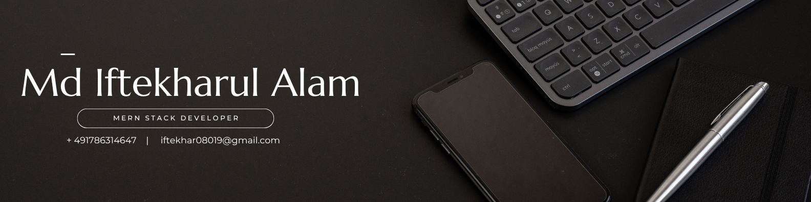

## Hi 👋, I'm Iftekhar

🎯 **Web Developer** | **Medical Engineering Graduate**  
📍 Based in Erlangen, Germany  

💡 **Tech Stack:** React • Next.js • Node.js • Express.js • MongoDB • TailwindCSS  
🎨 Passion for clean UI & smooth UX  
🚀 Love building scalable, high-performance apps  

🔍 Always learning — currently diving into RDBS
🤝 Open to collaborating on Open Source & Startup Projects  
⚡ Fun Fact: From **VR Rehab Systems** to **IoT Smart Homes** — I love creating tech that makes a difference!

---

## 📊 GitHub Stats

---

## 🚀 Skills & Technologies  

### 🔹 **Languages**  
     

### 🔹 **Front-end Development**  
     

### 🔹 **Back-end & Frameworks**  
    

### 🔹 **Mobile & Game Development**  
   

### 🔹 **Databases**  
   

---

## 🔗 Connect With Me
  

---

## 📌 Fun Fact & Quote

---

🚀 **Let's build something amazing together!** 🎯
